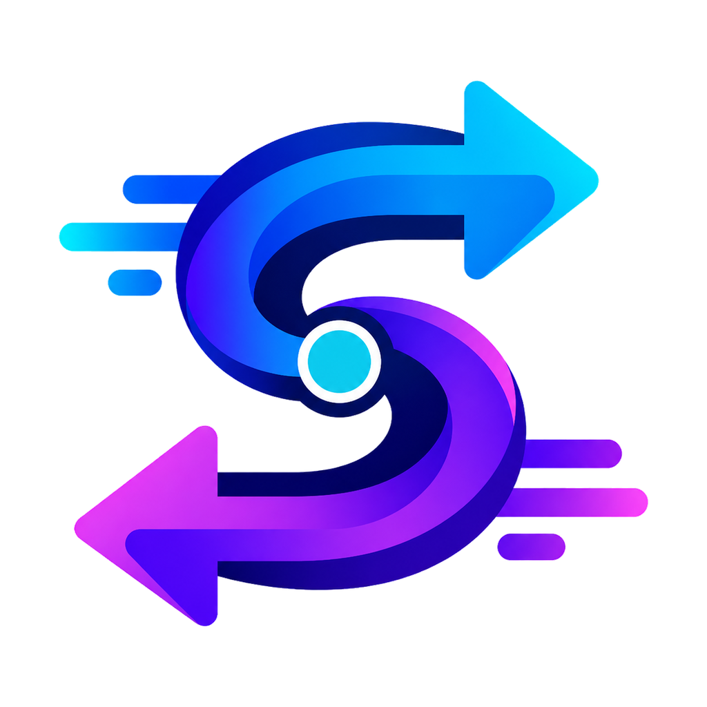

# CodexShift

<p align="center">
  
</p>

<p align="center">
  <strong>Provider 切换 + Codex 历史任务索引修复</strong><br>
  <sub>让官方账号、第三方 API 与历史任务一起安全切换</sub>
</p>

<p align="center">
  <a href="https://github.com/HanLoney/CodexShift/releases/latest">下载最新版</a> ·
  <a href="README_EN.md">English</a> ·
  <a href="https://github.com/HanLoney/CodexShift/issues">问题反馈</a>
</p>

<p align="center">
  <a href="https://github.com/HanLoney/CodexShift/actions/workflows/release.yml"></a>
  <a href="https://github.com/HanLoney/CodexShift/releases"></a>
  <a href="LICENSE"></a>
</p>

CodexShift 是一款独立的 **Codex Provider 切换与历史任务索引维护工具**。

它不只是修改 API 地址：在官方账号与第三方 API 之间切换时，CodexShift 会同步处理配置、认证凭据和历史任务中的 Provider 引用，并修复 `state_5.sqlite` 中缺失或异常的根任务索引，避免旧会话在切换后变成孤立记录、重复显示，或直接从历史列表中消失。

CodexShift 独立保存自己的配置，不依赖其他 Provider 管理工具，也不会读取或修改其他工具的数据。除此之外，它还支持在 **Codex 与 DeepSeek Harness 之间按项目、按会话选择性双向迁移聊天记录**，自动建立对应项目并恢复可见的用户/助手上下文。

```text
Codex 项目 / 独立会话 / 聊天记录  ⇄  DeepSeek Harness Workspace / Session / 聊天记录
```

迁移不是把所有历史一次性倒完：你可以选择具体项目和多个会话，使用精简上下文或完整聊天记录模式。双向导入都不会调用模型，也不会产生额外 API 用量。

> [!IMPORTANT]
> CodexShift 是社区项目，不是 OpenAI 官方产品，与 OpenAI 没有隶属或背书关系。

## 为什么是 CodexShift

很多工具都能替换 API 地址，但 Codex 的历史任务还依赖 rollout 文件和 `state_5.sqlite` 中的 Provider 及根任务索引。只替换配置，可能导致历史会话显示异常，甚至无法继续打开。

CodexShift 的核心流程是：

```text
切换 Provider → 备份 Codex 数据 → 同步历史任务 Provider → 修复根任务索引 → 完成切换
```

因此它关注的不只是“请求发到哪里”，还关注“以前的任务能不能继续找到、打开和使用”。

### 扩展能力：把项目和上下文带到另一套 Harness

除了 Provider 切换与历史索引修复，CodexShift 还能把已经积累的项目、会话和可见聊天上下文在 Codex 与 DeepSeek Harness 之间双向迁移，并保持项目归属，方便继续工作而不是从空白会话重新开始。

## 功能

- **原生官方账号切换**：内置“OpenAI 官方账号（原生）”入口，可恢复已保存的官方登录凭据，也可以安全返回 Codex 原生登录流程。
- **第三方 API 配置管理**：支持新建、编辑和删除配置，并在多套 Provider 之间快速切换。
- **API 与模型检测**：验证 API Key、接口连通性和 Responses 协议兼容性，并通过 OpenAI 兼容的 `/models` 接口自动发现可用模型。
- **配置与凭据同步**：切换时同时更新 Codex 配置和认证信息，自动移除互相冲突的官方账号或 API Key 字段。
- **Codex Home 路径管理**：自动识别当前用户的 `CODEX_HOME` / `~/.codex`，也支持手动指定其他目录。
- **历史任务索引同步（核心特性）**：扫描 rollout 历史文件，统一 `model_provider` 引用，更新 `state_5.sqlite`，并补齐遗漏的根任务索引，让旧会话在切换后继续可见、可打开。
- **独立修复历史索引**：无需切换 Provider，也可以单独扫描并重建历史任务索引。
- **安全备份与自动回滚**：修改前自动备份 Codex 数据，发生错误时恢复原配置与索引；默认保留最近 3 份备份。
- **Codex ↔ DeepSeek Harness 记录互导**：按项目和独立会话浏览、多选并双向迁移聊天记录，自动创建或复用对应项目，恢复用户/助手可见上下文。
- **可视化迁移过程**：显示百分比、当前处理项和可滚动实时日志，耗时操作在后台运行，避免界面假死。
- **多语言与跨平台**：提供简体中文、English、日本語、한국어界面；支持 Windows 和 macOS。
- **本地凭据保护**：Windows 使用 DPAPI、macOS 使用 Keychain 加密保存 Provider 凭据。

## 下载与使用

前往 [Releases](https://github.com/HanLoney/CodexShift/releases/latest) 下载：

| 系统 | 文件 |
| --- | --- |
| Windows 10/11 x64 | `CodexShift-v1.8.1-Windows-x64.exe` |
| macOS | `CodexShift-v1.8.1-macOS-Universal.zip` |

1. 打开 CodexShift，确认顶部显示的 Codex Home 路径正确。
2. 选择内置官方账号，或新建一个第三方 API 配置。
3. 可先点击“检测 API”，确认接口、密钥和模型可用。
4. 选择目标 Provider，点击“切换到选中 Provider”；应用会自动备份并同步历史任务索引。

### Codex 与 DeepSeek Harness 双向迁移

点击主界面的“迁移项目与会话”，选择来源和 DeepSeek Harness 地址（默认 `http://127.0.0.1:3080`），先选一个项目，再在右侧多选需要迁移的会话，最后点击“预览”或“导入选中项”。

- Codex → DeepSeek Harness：自动创建/复用对应 Workspace，并为每个选中会话创建新 Session。
- DeepSeek Harness → Codex：把选中的会话转换为 Codex 可索引的 rollout，并自动重建 `state_5.sqlite` 索引。
- “精简上下文”逐条导入最近消息；“完整聊天记录”逐条恢复尽可能完整的用户/助手历史；两种模式都不会调用模型。“只建立项目”仅创建项目入口。
- 导入到 Codex 时会自动关闭 Codex，写入前备份数据库；冲突或失败会删除本次新建 rollout 并恢复备份，完成后自动重新打开 Codex。

迁移会恢复可见聊天消息和项目归属，但不会恢复模型 KV Cache、实时 Shell、工具调用现场、审批状态或其他 Harness 内部运行状态；DeepSeek Harness 的接口与本地会话格式仍可能随其 developer preview 版本变化。

切换时 Codex 需要退出。建议保留“自动关闭 Codex”和“完成后重新打开”。备份目录位于 `~/.codex/switcher_backups`。

### 历史任务索引是怎么处理的

切换过程中，CodexShift 会处理两类数据：

- rollout 历史文件中的 `model_provider` 引用；
- `state_5.sqlite` 中用于发现会话的任务索引和根线程记录。

所有修改都会先备份；如果同步或数据库校验失败，会自动回滚到切换前状态。

### 首次启动提示

- Windows 未签名版本可能触发 SmartScreen，可选择“更多信息”后确认运行。
- macOS 版本使用临时签名，首次打开可在 Finder 中右键应用并选择“打开”。
- 请只从本仓库的 Releases 页面下载。

## 官方账号说明

浏览器中的 Google / ChatGPT 登录 Cookie 不等于 Codex 的 `auth.json` 凭据。若本机没有可恢复的 Codex 官方凭据，切回官方模式后仍需在 Codex 中选择“使用 ChatGPT 登录”，再使用原来的 Google 账号完成授权。

## 从源码运行

需要 Python 3.11+ 和 Tkinter。

```powershell
python codex_switcher.py
```

运行测试：

```powershell
python -m unittest discover -s tests -v
```

构建 Windows：

```powershell
.\build.ps1
```

构建 macOS：

```bash
chmod +x build_macos.sh
./build_macos.sh
```

## 安全与隐私

- 不会上传 API Key、账号令牌、配置或历史记录。
- 不会在日志中输出完整密钥或令牌。
- 所有修改都在本机完成，并在写入前创建备份。
- `auth.json` 本身包含敏感凭据，请勿分享或提交到仓库。
- 安全问题请参阅 [SECURITY.md](SECURITY.md)。

## 许可证

[MIT License](LICENSE)
